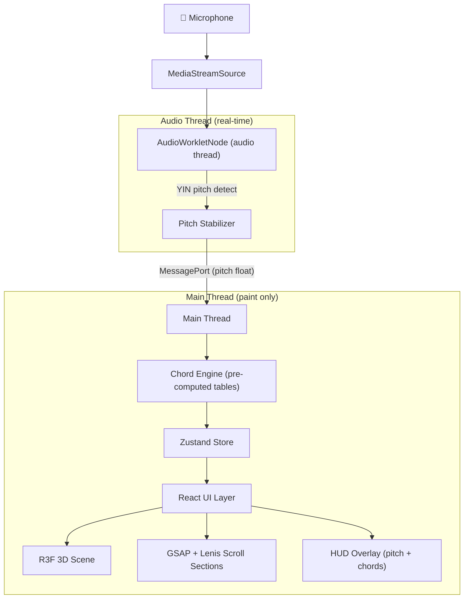

# VoxChord — Implementation Plan (Part 1 of 2)
## Architecture, Audio Engine & Music Theory Core

---

## 1. High-Level Architecture



### Two Distinct Modes

| Mode | Purpose | Rendering |
|------|---------|-----------|
| **Landing / Marketing** | Cinematic 3D scroll experience showcasing VoxChord | R3F + GSAP + Lenis, full 3D scenes, scroll-driven animations |
| **Live Session** | Real-time pitch detection + chord suggestion | Minimal 3D background, HUD overlay, AudioWorklet active |

---

## 2. Project Scaffolding

### 2.1 Initialize Next.js

```bash
npx -y create-next-app@latest ./ --typescript --tailwind --eslint --app --src-dir --import-alias "@/*" --use-npm
```

### 2.2 Install Dependencies

```bash
# 3D Engine
npm install three @react-three/fiber @react-three/drei @react-three/postprocessing

# Animation + Scroll
npm install gsap @gsap/react lenis

# State
npm install zustand

# UI Animation
npm install framer-motion

# Utilities
npm install clsx
```

### 2.3 Directory Structure

```
src/
├── app/
│   ├── layout.tsx              # Root layout, fonts, metadata
│   ├── page.tsx                # Landing page (cinematic scroll)
│   └── session/
│       └── page.tsx            # Live session page
├── components/
│   ├── landing/
│   │   ├── HeroScene.tsx       # R3F hero 3D scene
│   │   ├── FeaturesSection.tsx # Scroll-animated feature cards
│   │   ├── DemoSection.tsx     # Interactive demo teaser
│   │   ├── HowItWorks.tsx      # Pipeline visualization
│   │   └── CTASection.tsx      # Call to action
│   ├── session/
│   │   ├── PitchIndicator.tsx  # Real-time pitch HUD
│   │   ├── ChordCards.tsx      # Animated chord suggestions
│   │   ├── ChordHistory.tsx    # Horizontal chord strip
│   │   ├── KeyDisplay.tsx      # Detected key + manual override
│   │   ├── SessionScene.tsx    # Ambient 3D background
│   │   └── LatencyMonitor.tsx  # Latency display
│   ├── three/
│   │   ├── MusicNote3D.tsx     # Animated 3D music note model
│   │   ├── SoundWave3D.tsx     # Procedural waveform mesh
│   │   ├── PianoKeys3D.tsx     # 3D piano keyboard
│   │   ├── ParticleField.tsx   # Audio-reactive particles
│   │   └── Environment.tsx     # HDRI + lighting setup
│   └── ui/
│       ├── GlassCard.tsx       # Glassmorphism card component
│       ├── ScrollProgress.tsx  # Scroll progress indicator
│       └── Button.tsx          # Styled button
├── audio/
│   ├── pitch-worklet.js        # AudioWorkletProcessor (YIN + stabilizer)
│   ├── AudioEngine.ts          # AudioContext setup + worklet registration
│   ├── ChordEngine.ts          # Pre-computed chord lookup tables
│   └── KeyDetector.ts          # Krumhansl-Schmuckler key detection
├── stores/
│   ├── useAudioStore.ts        # Pitch, note, cents, voiced state
│   ├── useChordStore.ts        # Chord suggestions, history, key
│   └── useScrollStore.ts       # Scroll position, active section
├── shaders/
│   ├── waveVertex.glsl         # Sound wave vertex shader
│   ├── waveFragment.glsl       # Sound wave fragment shader
│   └── particleFragment.glsl   # Particle glow shader
├── constants/
│   ├── musicTheory.ts          # Scale degrees, intervals, chord types
│   ├── keyProfiles.ts          # Krumhansl-Schmuckler profiles
│   └── theme.ts                # Color palette, design tokens
├── hooks/
│   ├── useAudioEngine.ts       # Hook to init/destroy audio pipeline
│   ├── useLenis.ts             # Lenis scroll integration hook
│   └── useGSAPTimeline.ts      # GSAP timeline hook
└── public/
    ├── models/                 # .glb files (notes, instruments)
    ├── hdri/                   # HDRI environment maps
    ├── textures/               # PBR textures
    └── worklets/
        └── pitch-worklet.js    # Copied here for worklet loading
```

---

## 3. Audio Engine — Phase by Phase

### 3.1 AudioWorklet Processor (`pitch-worklet.js`)

This file runs **entirely on the audio thread**. No imports, no DOM, no async.

```javascript
// public/worklets/pitch-worklet.js
class PitchWorklet extends AudioWorkletProcessor {
  constructor() {
    super();
    this.BUFFER_SIZE = 2048;
    this.HOP = 512;
    this.buf = new Float32Array(this.BUFFER_SIZE);
    this.writeHead = 0;
    this.hopCounter = 0;
    this.YIN_THRESHOLD = 0.10;
    this.MIN_RMS = 0.005;

    // Pitch stabilisation
    this.medianBuf = [];
    this.MEDIAN_SIZE = 5;
    this.currentPitchClass = -1;
    this.onsetTimer = 0;
    this.ONSET_HOLD_MS = 60;
    this.HYSTERESIS_CENTS = 80;
    this.lastStableMidi = -1;
  }

  process(inputs) {
    const input = inputs[0]?.[0];
    if (!input) return true;

    // Accumulate 128-sample chunks into analysis buffer
    for (let i = 0; i < input.length; i++) {
      this.buf[this.writeHead % this.BUFFER_SIZE] = input[i];
      this.writeHead++;
    }

    this.hopCounter += input.length;
    if (this.hopCounter >= this.HOP) {
      this.hopCounter = 0;

      // Linearize circular buffer for analysis
      const head = this.writeHead % this.BUFFER_SIZE;
      const analysis = new Float32Array(this.BUFFER_SIZE);
      for (let i = 0; i < this.BUFFER_SIZE; i++) {
        analysis[i] = this.buf[(head + i) % this.BUFFER_SIZE];
      }

      const rms = this.computeRMS(analysis);
      if (rms < this.MIN_RMS) {
        this.port.postMessage({ pitch: -1, midi: -1, pitchClass: -1,
                                cents: 0, rms, voiced: false, stable: false });
        return true;
      }

      const result = this.yin(analysis);
      if (result.pitch > 0) {
        const stabilised = this.stabilise(result);
        this.port.postMessage({
          pitch: result.pitch,
          midi: result.midi,
          cents: result.cents,
          pitchClass: stabilised.pitchClass,
          stable: stabilised.stable,
          rms, voiced: true
        });
      } else {
        this.port.postMessage({ pitch: -1, midi: -1, pitchClass: -1,
                                cents: 0, rms, voiced: false, stable: false });
      }
    }
    return true;
  }

  yin(buf) {
    const N = buf.length;
    const halfN = Math.floor(N / 2);
    const minLag = Math.floor(sampleRate / 1200); // ~C6
    const maxLag = Math.min(Math.floor(sampleRate / 70), halfN); // ~B1

    // Step 1: Difference function
    const d = new Float32Array(halfN);
    for (let tau = 1; tau < halfN; tau++) {
      let sum = 0;
      for (let t = 0; t < halfN; t++) {
        const delta = buf[t] - buf[t + tau];
        sum += delta * delta;
      }
      d[tau] = sum;
    }

    // Step 2: Cumulative mean normalised difference
    const dPrime = new Float32Array(halfN);
    dPrime[0] = 1;
    let runningSum = 0;
    for (let tau = 1; tau < halfN; tau++) {
      runningSum += d[tau];
      dPrime[tau] = d[tau] / (runningSum / tau);
    }

    // Step 3: Absolute threshold — search within voice range
    let bestTau = -1;
    for (let tau = minLag; tau < maxLag; tau++) {
      if (dPrime[tau] < this.YIN_THRESHOLD) {
        while (tau + 1 < maxLag && dPrime[tau + 1] < dPrime[tau]) tau++;
        bestTau = tau;
        break;
      }
    }

    if (bestTau === -1) return { pitch: -1, midi: -1, cents: 0 };

    // Voiced/unvoiced check
    if (dPrime[bestTau] > 0.15) return { pitch: -1, midi: -1, cents: 0 };

    // Step 4: Parabolic interpolation
    let refined = bestTau;
    if (bestTau > 0 && bestTau < halfN - 1) {
      const a = dPrime[bestTau - 1];
      const b = dPrime[bestTau];
      const c = dPrime[bestTau + 1];
      refined = bestTau + (a - c) / (2 * (a - 2 * b + c));
    }

    // Step 5: Convert
    const pitch = sampleRate / refined;
    const midi = 12 * Math.log2(pitch / 440) + 69;
    const nearestMidi = Math.round(midi);
    const cents = (midi - nearestMidi) * 100;

    return { pitch, midi, cents, nearestMidi };
  }

  stabilise(result) {
    // Median filter
    this.medianBuf.push(result.midi);
    if (this.medianBuf.length > this.MEDIAN_SIZE) this.medianBuf.shift();
    const sorted = [...this.medianBuf].sort((a, b) => a - b);
    const medianMidi = sorted[Math.floor(sorted.length / 2)];
    const pitchClass = Math.round(medianMidi) % 12;

    // Hysteresis
    if (this.lastStableMidi >= 0) {
      const centsDiff = Math.abs(medianMidi - this.lastStableMidi) * 100;
      if (centsDiff < this.HYSTERESIS_CENTS) {
        return { pitchClass: this.currentPitchClass, stable: true };
      }
    }

    // Onset hold (simplified — count hops)
    if (pitchClass !== this.currentPitchClass) {
      this.onsetTimer += (this.HOP / sampleRate) * 1000;
      if (this.onsetTimer < this.ONSET_HOLD_MS) {
        return { pitchClass: this.currentPitchClass, stable: false };
      }
      this.currentPitchClass = pitchClass;
      this.lastStableMidi = medianMidi;
      this.onsetTimer = 0;
    }

    return { pitchClass: this.currentPitchClass, stable: true };
  }

  computeRMS(buf) {
    let sum = 0;
    for (let i = 0; i < buf.length; i++) sum += buf[i] * buf[i];
    return Math.sqrt(sum / buf.length);
  }
}

registerProcessor('pitch-worklet', PitchWorklet);
```

### 3.2 AudioEngine Class (`src/audio/AudioEngine.ts`)

```typescript
// Manages AudioContext lifecycle, worklet registration, mic permissions
export class AudioEngine {
  private ctx: AudioContext | null = null;
  private workletNode: AudioWorkletNode | null = null;
  private source: MediaStreamAudioSourceNode | null = null;

  async init(onPitchData: (data: PitchData) => void): Promise<AudioLatencyInfo>
  async stop(): Promise<void>
  getLatency(): { baseLatency: number; outputLatency: number; total: number }
}
```

**Key implementation details:**
- `getUserMedia` with all processing **off** (`echoCancellation: false`, etc.)
- `AudioContext({ latencyHint: 'interactive', sampleRate: 44100 })`
- `addModule('/worklets/pitch-worklet.js')` to register worklet
- `workletNode.port.onmessage` → feeds `onPitchData` callback
- Connect: `source → workletNode → ctx.destination` (destination muted)

---

## 4. Key Detection (`src/audio/KeyDetector.ts`)

### Krumhansl-Schmuckler Algorithm

```typescript
export class KeyDetector {
  // Major key profile (Krumhansl & Kessler 1982)
  private static MAJOR_PROFILE = [6.35, 2.23, 3.48, 2.33, 4.38, 4.09,
                                   2.52, 5.19, 2.39, 3.66, 2.29, 2.88];
  // Minor key profile
  private static MINOR_PROFILE = [6.33, 2.68, 3.52, 5.38, 2.60, 3.53,
                                   2.54, 4.75, 3.98, 2.69, 3.34, 3.17];

  private histogram: number[] = new Array(12).fill(0);
  private window: { pitchClass: number; timestamp: number }[] = [];
  private WINDOW_MS = 8000;
  private DECAY_HALFLIFE_MS = 3000;

  addObservation(pitchClass: number): void
  detectKey(): { key: string; mode: 'major' | 'minor'; confidence: number }
  reset(): void
}
```

**Logic:** Every 2 seconds, compute Pearson correlation of the decayed histogram against all 24 rotations (12 major + 12 minor) of the profile vectors. Highest correlation = detected key.

---

## 5. Chord Suggestion Engine (`src/audio/ChordEngine.ts`)

### Pre-computed at startup — zero runtime computation

```typescript
interface ChordSuggestion {
  chord: string;        // e.g. "Am", "F", "C"
  role: string;         // "root" | "third" | "fifth" | "seventh" | "ninth"
  stability: number;    // 0.0 - 1.0
  resolvesTo?: string;  // e.g. "C" if leading tone
}

// chordTable[keyIndex][pitchClass] → ChordSuggestion[]
type ChordTable = ChordSuggestion[][][]; // [24 keys][12 pitch classes][suggestions]

export class ChordEngine {
  private table: ChordTable;

  constructor() {
    this.table = this.precompute();
  }

  suggest(key: number, mode: 'major' | 'minor', pitchClass: number): ChordSuggestion[]
}
```

**Diatonic chord sets:**

| Degree | Major Key | Minor Key (natural) |
|--------|-----------|-------------------|
| I / i | Major | Minor |
| ii / ii° | Minor | Diminished |
| iii / III | Minor | Major |
| IV / iv | Major | Minor |
| V / v | Major | Minor (or Major) |
| vi / VI | Minor | Major |
| vii° / VII | Diminished | Major |

**Role stability scores:** Root=1.0, Fifth=0.85, Third=0.80, Seventh=0.60, Ninth=0.40. Notes not in chord are excluded.

**Tension annotations:** Scale degree 7 → "→ resolves to I", Scale degree 4 → "→ resolves down".

---

## 6. Zustand Stores

### `useAudioStore.ts`
```typescript
interface AudioState {
  isActive: boolean;
  pitch: number;           // Hz, -1 if unvoiced
  midi: number;
  pitchClass: number;      // 0-11
  noteName: string;        // "C", "C#", etc.
  cents: number;           // ±50
  rms: number;
  voiced: boolean;
  stable: boolean;
  latency: { base: number; output: number; total: number };
  // Actions
  startSession: () => Promise<void>;
  stopSession: () => void;
}
```

### `useChordStore.ts`
```typescript
interface ChordState {
  detectedKey: { key: string; mode: string; confidence: number } | null;
  manualKeyOverride: string | null;
  suggestions: ChordSuggestion[];
  history: { chord: string; timestamp: number }[];
  // Actions
  updateSuggestions: (pitchClass: number) => void;
  overrideKey: (key: string | null) => void;
}
```

### `useScrollStore.ts`
```typescript
interface ScrollState {
  progress: number;        // 0-1 overall
  activeSection: number;   // index of current section
  isInSession: boolean;
}
```

---

> **End of Part 1** — Continues in Part 2 with the 3D cinematic UI, landing page design, shader specifications, scroll orchestration, session UI, and deployment.
